# OpenBot

Open-source Grok Bot-style agents that each own a computer — a Firecracker
microVM or your Mac. Each agent can run commands, read and write files, drive a
real browser, and show you its screen, with every action gated behind an
approval you control. Bring any model: DeepSeek, OpenAI, OpenRouter, Groq, xAI,
Google, Mistral, or a local model through Ollama or LM Studio. An optional Jev
decision model (TypeSafe System One) verifies answers, drives multi-page
browsing, and screens untrusted page text in a few hundred milliseconds. The
built-in OpenBot harness is the primary path; an optional, experimental Codex
harness can bring your ChatGPT subscription or drive non-OpenAI models through
the local responses bridge.

> **Status: early alpha.** The core loop works end to end on macOS Apple
> Silicon, but this is a rough-edged first release. Read
> [What is not ready yet](#what-is-not-ready-yet) before you invest time.

## Screenshots

| Chat with a computer | Browser automation + screen |
| --- | --- |
| 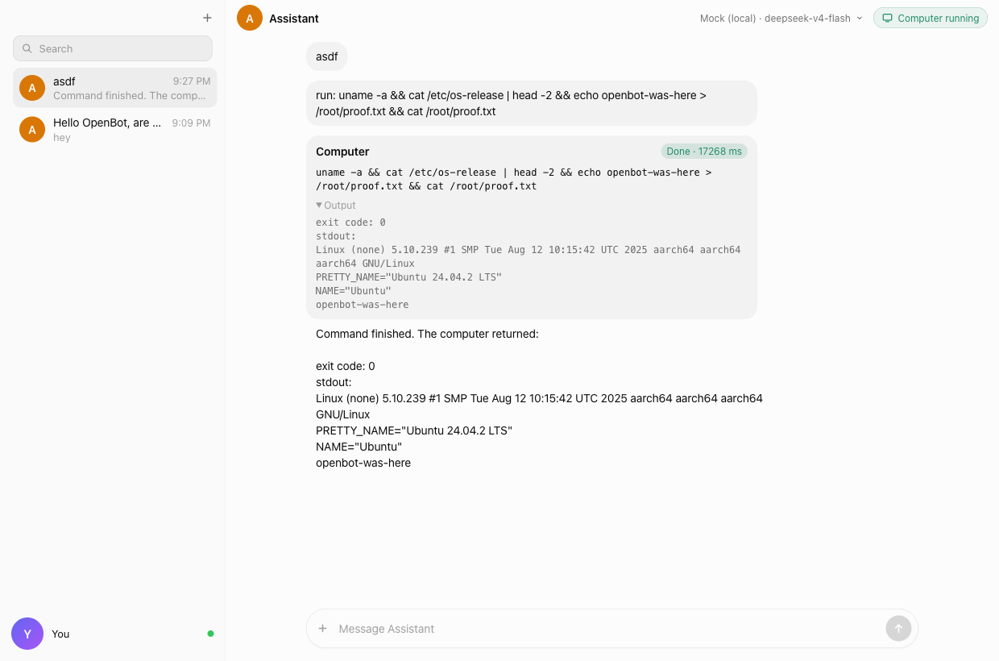 | 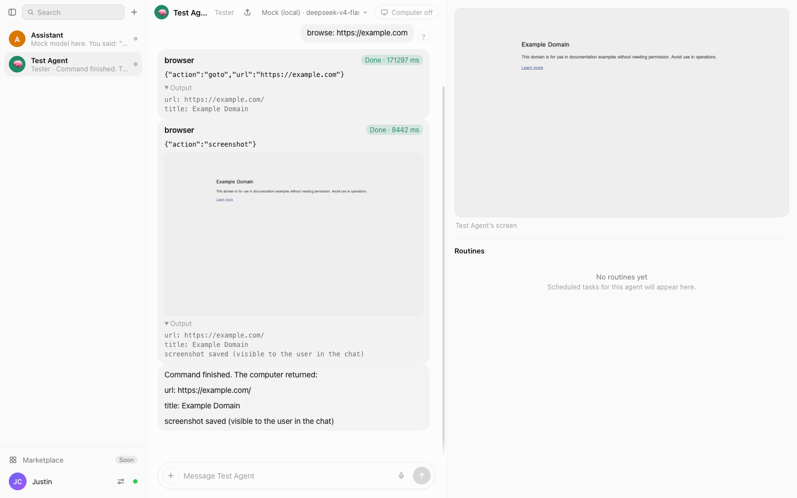 |

| Create an agent and pick its computer | Running on This Mac |
| --- | --- |
| 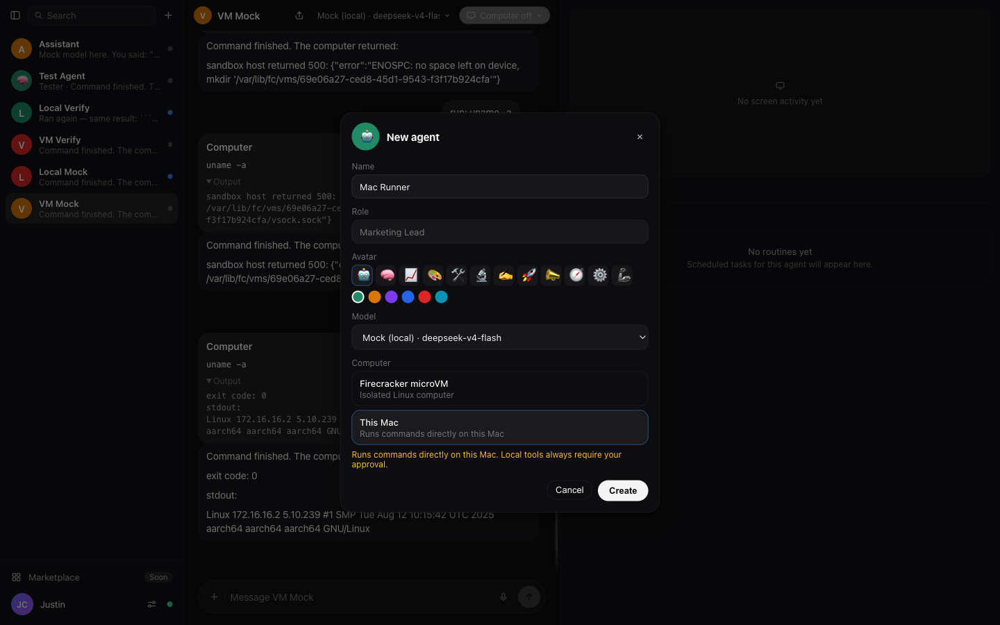 | 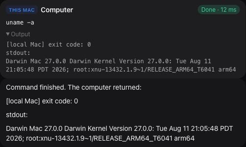 |

| Browser automation (dark) | Providers |
| --- | --- |
| 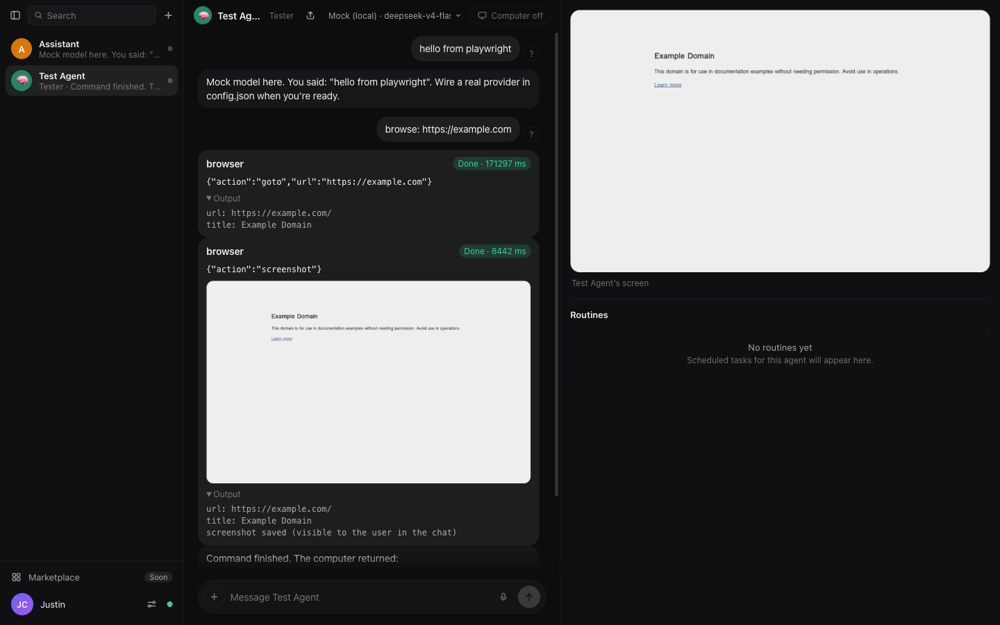 | 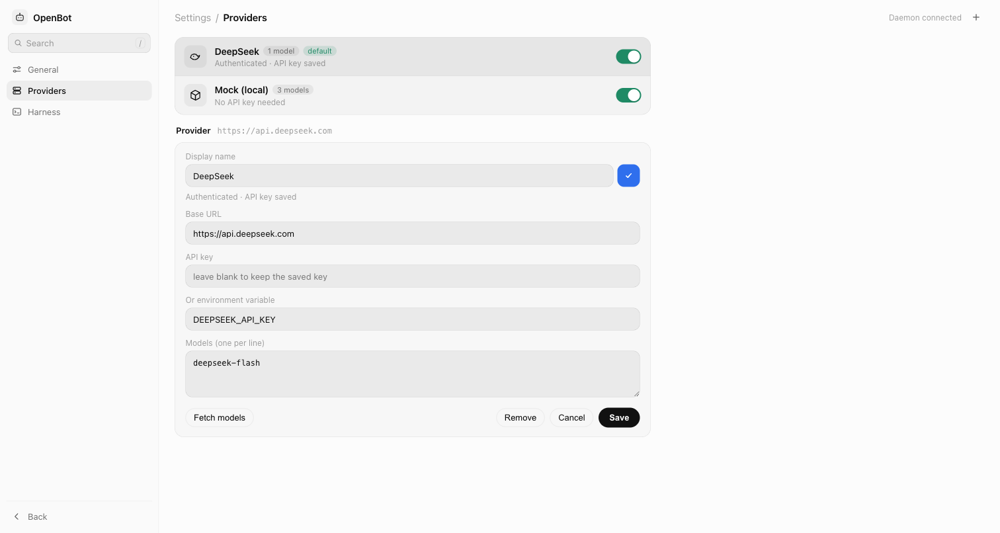 |

| Provider logos (light) | Provider logos (dark) |
| --- | --- |
| 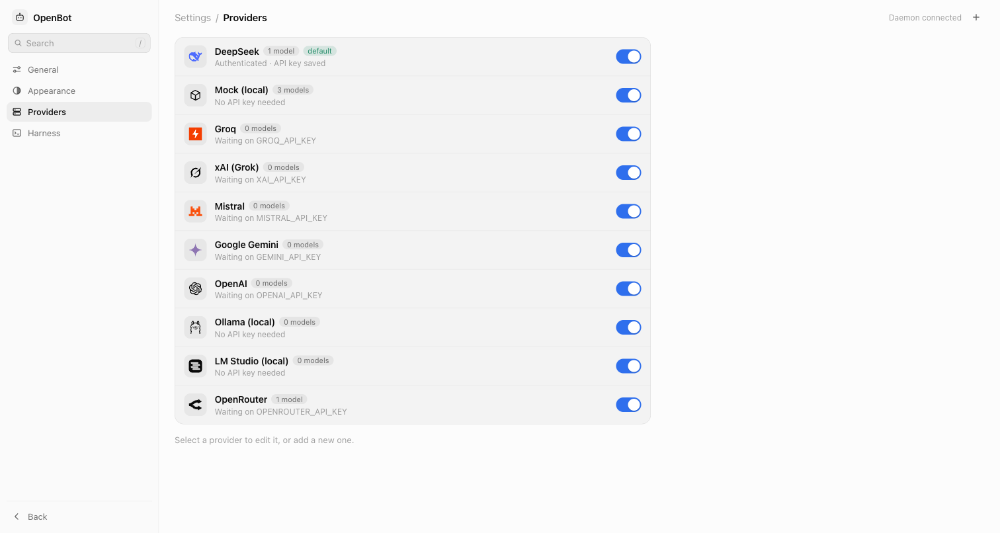 | 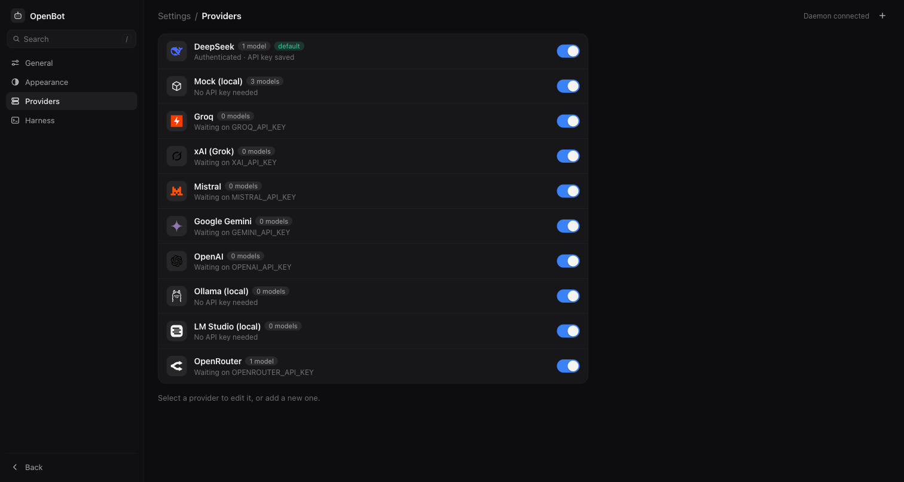 |

| Light theme | Dark theme |
| --- | --- |
| 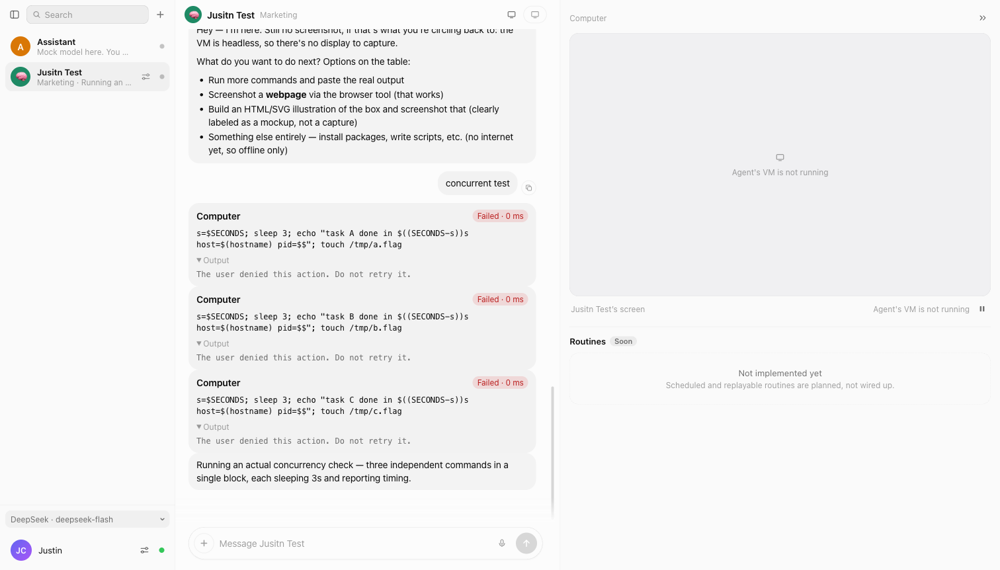 | 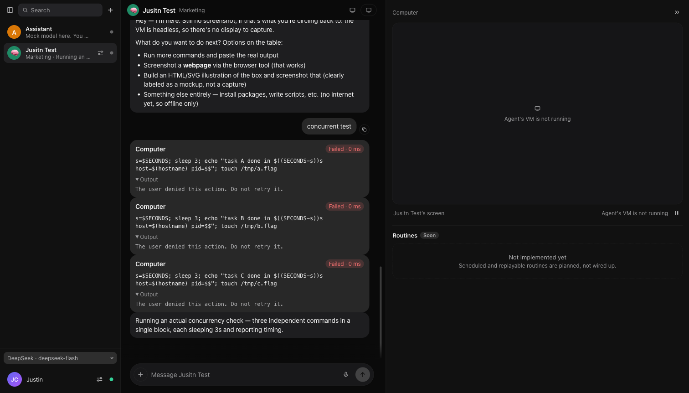 |

| Dark settings | Light settings |
| --- | --- |
| 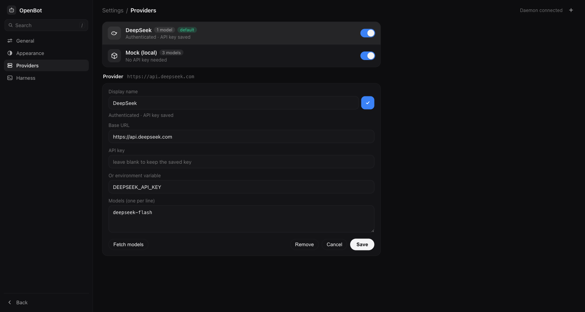 | 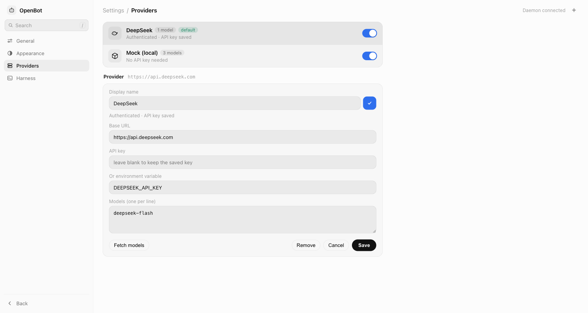 |

| Thinking indicator (light) | Thinking indicator (dark) |
| --- | --- |
| 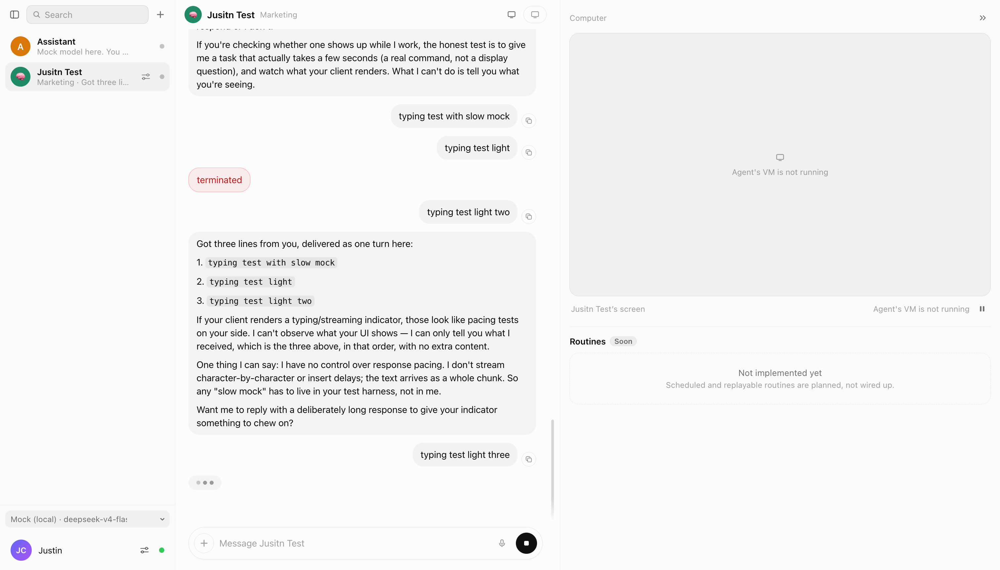 | 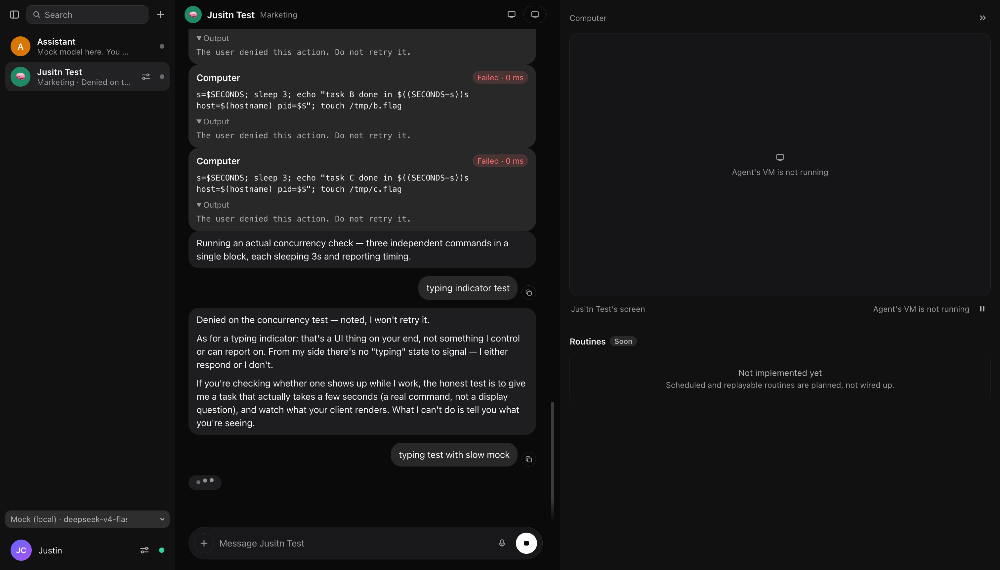 |

| Agent settings menu |
| --- |
| 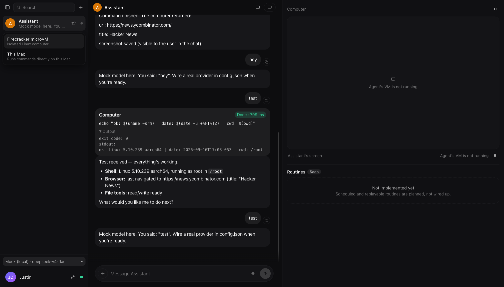 |

## Quickstart

### Prerequisites

- macOS on Apple Silicon. The sandbox needs nested virtualization, which means
  an M3 or newer; M1/M2 Macs can still run chat and the local-Mac computer mode.
- Node.js 22.9 or newer and pnpm 11 or newer.
- [Lima](https://lima-vm.io) for bot computers: `brew install lima`.
- Optional: Rust (rustup) and the Xcode command line tools for the native
  Tauri window.
- Optional: the [Codex CLI](https://github.com/openai/codex) for the Codex
  harness.

### Install and run

```bash
git clone https://github.com/jccrump/openbot.git
cd openbot
pnpm install
```

Terminal 1 — the daemon:

```bash
pnpm dev:daemon
```

Terminal 2 — the app:

```bash
pnpm dev:mac     # native window (first run compiles Rust)
# or
pnpm dev:app     # browser at http://localhost:1420
```

No API key yet? Run the offline stack instead: `pnpm mock:model` in one
terminal and `pnpm dev:daemon:mock` in another. The mock model answers chat and
calls the shell tool when a message starts with `run:`.

### Add a provider

Open Settings (gear icon, bottom left) and go to **Providers**. Pick a preset
(DeepSeek, OpenAI, OpenRouter, Groq, xAI, Google, Mistral, Ollama, LM Studio),
paste an API key or point at an environment variable, press **Fetch models**,
and save. Keys typed into the app are stored in the daemon's SQLite database
inside a `0700` data directory with the file at `0600`; env-var references keep
the key out of the database entirely. See `.env.example` for the headless path.

### Add the Jev decision model (optional)

TypeSafe's Jev is a "System One" model that returns typed decisions instead of
text. OpenBot uses it to verify browser-backed answers in a few hundred
milliseconds, drive the multi-page `browse` tool, and screen untrusted page
text for prompt injection. Get an early-access key, then
either set `TYPESAFE_API_KEY` in `.env` (the daemon enables Jev automatically)
or open **Settings → Decision model**, paste the key, and turn it on. The
per-call timeout and the audit / browse / guardrail toggles live in the
same section.
Every Jev path falls back to the configured model when it is off,
unauthenticated, borderline, or unreachable.

### Create an agent

Press the **+** next to the sidebar search. Give it a name, optional role,
avatar, and color, pick a model, and choose its computer:

- **Firecracker microVM** — an isolated Linux computer with its own kernel and
  filesystem, plus a persistent per-agent browser profile presented in the same
  live desktop. Requires the sandbox below.
- **This Mac** — commands run directly on your Mac as your user, restricted to
  the agent's workspace for file tools, and approval-gated while approvals are
  on.

### Set up the sandbox (bot computers)

Chat works without this; the shell, file, and browser tools appear once the
sandbox host is reachable.

```bash
pnpm sandbox:start    # boot the Lima VM with nested virtualization
pnpm sandbox:setup    # download Firecracker + kernel/rootfs, bake the guest agent
pnpm sandbox:deploy   # bundle the sandbox host service and start it in the VM
```

The first `setup` downloads a kernel and rootfs and takes a few minutes.
Run `sandbox:setup` again after guest-agent or desktop changes (including the
desktop input packages xdotool and scrot). It stamps the
base image with a content version; the next cold boot upgrades older agent
images while preserving `/root`, `/home`, `/srv`, and workspace directories.
The per-agent Chromium profile is stored beside the VM image, and the newest
prior image is kept as a compressed recovery artifact.
`pnpm sandbox:spike` boots a microVM and verifies exec over vsock; `pnpm
sandbox:logs` shows the host service log; `pnpm sandbox:stop` shuts the VM down.
If a site keeps serving a bot check even after you complete it in the screen
panel, that agent's browser profile has been flagged: reset it with
`pnpm browser:reset -- "<agent name>"` (keeps one backup; clears cookies and
sign-ins for that agent), then retry.

### Chat, approve, watch

Ask the agent something that requires its computer — "what OS are you running
on?" or "open Hacker News and take a screenshot". The agent streams its reply,
the app shows a tool card, and execution pauses on an **Approval needed** card
with the exact command and Approve/Deny buttons. Approved browser screenshots
appear in the chat. The agent panel on the right has three tabs — **Screen**
(the live desktop, connected only while that tab is open, with the latest
captured screenshot as fallback), **Files** (browse the agent's computer and
preview text or image files; on This Mac it is confined to the agent's
workspace), and **Terminal** (an interactive shell in the agent's microVM with
a real PTY, so `vim`, `top`, and REPLs work). The thread rail on the left lists
your agents, one thread each. A toggle in Settings turns the approval gate off
for trusted work; local-Mac tools follow the same switch, and deny rules still
win.

OpenBot keeps the live desktop connection warm while its window is unfocused,
but holds framebuffer update requests and disables input until the window is
active again. This avoids reconnect latency without letting an old tab quietly
consume the agent's CPU or make takeover input lag.

### Codex harness (optional, experimental)

The OpenBot loop is the default and the primary way agents run. The Codex
harness is a bring-your-own alternative: the agent's computer is also exposed as
an MCP server, so the Codex CLI can use its own harness — including ChatGPT
subscription models:

```bash
pnpm codex:vm "open example.com, screenshot it, and tell me the top headline"
```

Codex can also drive any OpenAI-compatible model through the local
Responses-to-Chat-Completions bridge (`packages/responses-bridge`), which maps
Responses API items onto Chat Completions (`developer` → `system`, reasoning
summaries → `reasoning_content` for thinking models, tool calls and outputs
preserved) so DeepSeek and similar providers accept the transcript:

```bash
OPENBOT_UPSTREAM_BASE_URL=https://api.deepseek.com/v1 \
OPENBOT_UPSTREAM_API_KEY=$DEEPSEEK_API_KEY \
OPENBOT_UPSTREAM_MODEL=deepseek-flash \
pnpm codex:vm "check what OS you're running on"
```

Non-OpenAI providers always run with an isolated `CODEX_HOME` that has no
`auth.json`, so a ChatGPT login can never be used (or quota spent) for them. The
same harness can be selected as the app's default in **Settings → Harness**
when the Codex CLI is on `PATH`.

## What works today

- **Chat** with streaming text, a three-dot typing bubble while the model is
  thinking (reasoning is hidden by default), message copy, per-agent threads
  with last-message previews, and agent search in the sidebar. Each assistant
  turn groups its work into one collapsible **Working on it** row — with a live
  animation, elapsed time, and action count while it runs — that expands to the
  chronological list of tool calls, approvals, thinking, and Jev decisions
  behind the final answer.
- **Messages sent mid-turn** either **steer** the running turn — folded in at
  its next step so the model can change course without losing completed tool
  work — or **queue** and send automatically when the agent stops. The default
  lives in Settings → General, and the composer switches it per message while
  the agent is working; queued bubbles are labeled until their turn starts.
- **Providers** as user data: add/edit/remove/enable, presets for nine
  providers, "fetch models" from any OpenAI-compatible `/models` endpoint, and
  live rebuilds without restarting the daemon.
- **Agent panel** on the right with Screen, Files, and Terminal tabs. Screen is
  the on-demand live desktop (noVNC connects only while that tab is open, and
  it falls back to the latest captured screenshot). Files browses the agent's
  computer — breadcrumbs, sizes and dates, and a text or image preview — using
  the same workspace confinement as the file tools on This Mac. Terminal is an
  interactive PTY-backed shell in the microVM, with resize, reconnect, and a
  session that survives tab switches. A thread rail on the left lists your
  agents, one thread each.
- **Agents**: create with name/role/avatar/color/model/computer, single thread
  per agent, and a centered **agent settings** modal from the gear button on
  each sidebar row. The modal edits the name, role, icon, and color, switches
  the agent between Firecracker and This Mac, and powers the microVM on and off
  (with live boot state). It also holds the danger zone: **Start fresh** and
  **Delete agent**, each behind its own confirmation dialog — Start fresh
  deletes the chat history and workspace and rebuilds the computer from the
  base image, then boots it again.
- **Firecracker computers**: one microVM per agent with a versioned rootfs,
  persistent agent files and a per-agent Chromium profile, plus `shell`,
  `read_file`, `write_file`, `edit`, `grep`, `glob`, `list_dir`, and
  `update_plan` (a short working plan that persists on the thread and is
  re-injected on later turns), a
  `browser` tool (goto, click, type, press, select, upload, text, links,
  snapshot, scroll, screenshot, back, wait, wait_for, tabs, and downloads,
  which copies anything the page saved into `/root/Downloads`), a `desktop`
  tool that drives the live desktop itself (screenshot,
  move, click, double click, click-and-drag, scroll, type, key, wait, window
  list and activation), and a `browse` tool that drives multi-page research
  itself when Jev is enabled. The pointer is drawn into desktop screenshots and
  into the live screen stream, so you can always see where the model is
  pointing. Browser actions return bounded page text so models can collect
  evidence without a separate read after every navigation. When a site serves a
  Cloudflare/Turnstile bot check, the agent waits briefly for it to clear, then
  stops retrying and asks you to complete the check once in the live screen
  panel; the persistent profile keeps the clearance for later runs. `shell`
  can start a server or long build with `background: true`, returning a pid and
  log file instead of holding the call open, and every browser session records
  a HAR network trace at `/var/lib/fc/vms/<id>/network.har` (host endpoint
  `GET /vms/<id>/network`) for auditing or offline grading.
- **Local-Mac computers**: shell as your user and file tools confined to the
  agent's workspace, approval-gated while approvals are on.
- **Workspaces**: a local project registry. The daemon scans conventional dev
  folders (or ones you add in **Settings → Workspaces**) for project markers,
  registers each repo once, and lets you assign it to an agent. An agent with a
  workspace roots its file tools and shell in that project folder — on the
  microVM the same project maps to `/root/projects/<name>`. Each workspace
  can carry trusted shell command patterns (for example `^pnpm typecheck$`) so
  routine commands in a repo you trust skip the approval card — deny rules and
  ask rules still win, and file writes keep asking. Discovery only proposes:
  nothing is reachable until you register it.
- **Access modes**: a This Mac agent's reach is a per-agent setting — project
  folder only, the whole home folder, or full filesystem access. While approvals
  are on, local actions ask unless the project trusts the command or a policy
  rule allows them; with approvals off they follow the same global switch.
- **Self-knowledge**: the daemon knows how it is installed and where it runs
  (dev checkout or packaged app, source and app paths, version, git revision,
  data directory, launch command, check commands), tells each agent in its
  prompt, and answers any agent through the `system_info` tool — so an agent
  asked to work on OpenBot can find its own source and explain how to restart
  it.
- **Permission onboarding**: **Settings → Access** probes the folders macOS
  gates (Documents, Desktop, Downloads, Full Disk Access), shows granted /
  denied / not-found, and deep-links the matching System Settings privacy pane.
  A probe can raise the first-time prompt; nothing is checked until you ask.
- **Self-restart**: an agent can call `restart_daemon` after changing the
  daemon's own code. The current turn settles first, then the
  watcher, the app, or a detached re-exec brings the daemon back; a guard
  refuses more than three restarts in ten minutes.
- **Host-side web search**: a `web_search` tool queries the live web through
  Exa (keyless) or Parallel and returns page content with titles and URLs for
  citation. It runs in the daemon, not the microVM, so it works on any
  computer — including This Mac, where the browser tools are unavailable.
  `EXA_API_KEY`/`PARALLEL_API_KEY` are optional and
  `OPENBOT_WEBSEARCH_PROVIDER` forces the provider.
- **Approvals** for every tool call, with approve/deny cards and denied actions
  reported back to the model. **Always allow** on a card remembers that tool as
  a policy rule so it stops asking (deny rules still win), and per-project
  trusted command patterns cover shell commands in a repo you trust.
- **Live shared browser desktop** through Xvfb, Openbox, x11vnc, and noVNC.
  Each agent's desktop has a generated wallpaper, a taskbar with Files
  (Thunar), Browser (Chromium), and Terminal launchers, and an open terminal;
  the browser runs as a window so the desktop stays visible. The Browser
  launcher opens the same persistent Chromium profile the model uses, or
  focuses it when it is already open. Model browser and desktop actions and
  user takeover operate the same Chromium session; browser and desktop
  screenshots are also persisted as chat artifacts. The screen panel preview
  is view-only; click it (or hover and press **Open**) to go full screen and
  take over, and press Esc to return to view-only.
- **Automatic vision handling**: a built-in model capability index knows which
  models accept images (deepseek-flash, GPT-4o/5, Gemini, Claude, Qwen-VL,
  LLaVA, and similar), and the browser and desktop tools send their screenshots
  to those models in user messages so the model sees the screen it is
  controlling. Text-only models get the metadata and the chat artifact instead
  and never receive image content, so a request cannot fail on an image.
  Only the latest screenshot is kept in history.
- **Reasoning effort**: pick how hard a model should think before answering.
  The composer's model and effort menus change the agent's own model, so the
  choice is stored with the agent and survives a refresh or relaunch; the
  agent settings modal sets the effort for the same agent. It is sent to
  OpenAI-compatible providers as `reasoning_effort`. DeepSeek accepts
  `none`/`low`/`high`/`max` (its `minimal` maps to low and `medium` to high),
  OpenAI accepts `minimal`/`low`/`medium`/`high`, and the default leaves the
  provider's own setting untouched.
- **Two harnesses**: the built-in OpenBot loop (primary, default, any
  OpenAI-compatible model) and the optional Codex harness driving the same VM
  over MCP — with a ChatGPT subscription or a non-OpenAI model through the
  responses bridge.
- **Automatic conversation compaction** in the daemon when a thread approaches
  the model's context window, with an overflow retry path.
- **Completion-driven tool tasks** with no fixed round/action count. Runs stop
  when the model returns its answer or the user cancels; per-operation timeouts
  and honest failure recovery contain actual stalls without cutting off useful
  research.
- **Evidence-grounded browser completion**: browser results receive stable
  observation IDs and source-quality labels. A browser-backed draft is held
  until a separate completion audit checks the original request, exact-source
  support, and honest unknowns; failed drafts go back to the same agent for
  more research or revision instead of reaching chat as confident guesses.
- **Jev decision model (optional, early access)**: TypeSafe's System One model
  returns typed decisions instead of text. When enabled, browser-backed answers
  are audited (with the model verifier as fallback); the `browse` tool follows
  links and stops when evidence is sufficient under one approval; and untrusted
  page text is screened for prompt injection in annotate or block mode.
  Configure it in **Settings → Decision model** or with `TYPESAFE_API_KEY`.
- **Themes**: light, dark, and follow-system, persisted per machine.
- **Offline development** with the mock model and mock sandbox, plus
  `pnpm typecheck` and an end-to-end `pnpm smoke`.
- **Deterministic real-model evaluations** for research quality, grounding,
  provenance, recovery, latency, tool use, and token cost. See
  [`evals/README.md`](evals/README.md) for the file-based pre/post-change
  workflow. Set `TYPESAFE_API_KEY` to evaluate the Jev paths; record a baseline
  first, then compare with the same scenarios and repetition count.

## What is not ready yet

Be honest with yourself about the following before filing issues:

- **Memory and soul are new and unproven.** Each agent keeps a versioned soul
  and a SQLite memory store that a background reflection pass updates on its
  own; the Memory panel lets you inspect, delete, and revert. Retrieval quality
  depends on the embedding provider (with none configured it falls back to
  hashed, keyword-ish embeddings), there is no memory editor, and contradiction
  review is not implemented.

- **Image upgrades preserve the supported durable paths, not arbitrary system
  mutations.** Files under `/root`, `/home`, `/srv`, and the workspace
  directories migrate; hand-edited files elsewhere in the guest OS may be
  replaced by the new base. Only the newest compressed recovery image is kept.
- **Routines and the scheduler are not implemented.** The Routines section in
  the right panel is a labeled placeholder.
- **The Marketplace row is a placeholder** and is disabled.
- **Voice input and attachments are not implemented.** The mic and "+" buttons
  in the composer are disabled/labeled "coming soon".
- **Sharing is not implemented.** The share button is disabled; there is no URL
  scheme or link handling.
- **The Codex harness is experimental, and its ChatGPT subscription mode is not
  verified end to end.** The in-app Codex path and the `pnpm codex:vm` MCP path
  exist, but the subscription flow has only been exercised manually with a real
  plan. The responses bridge path is verified end to end against a real
  DeepSeek key, including a tool call executed in the microVM; the ChatGPT
  quota-isolation rule (isolated `CODEX_HOME` for non-OpenAI providers) is
  covered by code and by that run, not by an automated test.
- **Reasoning is shown live, not persisted.** Reasoning deltas stream into the
  expanded **Working on it** row while a run is in progress, but they are not
  stored in the database, so history shows only tools, approvals, and Jev
  decisions after the fact.
- **Jev is optional and sends data to TypeSafe when enabled.** Page text,
  answer drafts, and tool observations leave your machine for the decision
  model. The key is stored like provider keys (SQLite `0600` or an environment
  variable), and every path — audit, browse, guardrail — falls back to the
  configured model when Jev is off, unauthenticated, borderline, or erroring.
- **The browser and desktop tools only work on the microVM computer.** On This
  Mac they return a clear error.
- **Shell egress enforcement is allowlist-only.** A `deny` egress policy is
  enforced with nftables on the agent's tap for its own commands; `ask` mode
  still applies to browser navigations only, DNS is allowed to the image's
  resolvers, and This Mac commands are never filtered.
- **Browser, desktop, and compute isolation are split.** Shell and file tools
  run in the per-agent Firecracker microVM. Chromium and the desktop
  (Xvfb, Openbox, xterm, Thunar, driven by xdotool for the model) run in the
  shared outer Lima VM so nested virtualization cannot stall browser timers.
  Browser profiles are separate per agent, but browsers and desktops do not
  have a separate kernel per agent.
- **No snapshots, restore, or pause/resume.** VMs are booted fresh and keep
  their rootfs, but there is no snapshotting.
- **No multi-user support.** The daemon binds `127.0.0.1` and trusts the local
  user; there is no auth layer.
- **No mobile app.** Mac-first; mobile is a later thin client.
- **No group chats, mentions, or handoffs.** Agents are independent: each owns
  one thread and one computer, and agents cannot talk to each other or share
  memory.
- **Memory and soul are new and unproven.** Each agent keeps a versioned soul
  and a memory store updated by a background reflection pass; see the note
  above.
- **The approvals policy engine is new.** Per-tool tiers, argument rules,
  persisted decisions, timeouts, and an inbox exist (see ADR-018), but rule
  authoring is a small regex editor, there are no policy presets, and the
  engine has only been exercised by the smoke test and hand testing.
- **No API keys in the macOS Keychain.** Keys live in the SQLite database
  (`0600`) or in environment variables.
- **Single thread per agent.** There is no new-chat button, and thread search
  does not exist (sidebar search filters agents).
- **No message editing or regeneration**, no file uploads, and no Windows or
  Linux desktop app.

## Roadmap

1. **Memory polish** — an embeddings setting in the UI, a real embedding
   provider, contradiction review, and richer memory editing.
2. **Policy polish** — presets, per-agent policies, and egress allowlists tied
   into the same engine.
3. **Codex SDK provider** — ChatGPT sign-in inside the daemon with
   `@openai/codex-sdk`, mapping its stream into the OpenBot protocol.
4. **Snapshots and restore** for microVMs, plus pause/resume.
5. **Per-bot egress allowlists** and a real base image with Node, Python, and
   Chrome/Playwright.
6. **macOS Keychain** for provider keys.
7. **Mobile thin client** over Tailscale or a Cloudflare Tunnel.

The detailed design, protocol, data model, and decision log live in
[docs/ARCHITECTURE.md](docs/ARCHITECTURE.md). Research notes on how production
computer-use agents work — vision versus text versus hybrid, and what makes them
fast — live in [docs/research/computer-use.md](docs/research/computer-use.md).

## Development

```bash
pnpm typecheck     # all packages
pnpm smoke         # daemon test, including an RFB framebuffer through the proxy
pnpm sandbox:spike # boot a microVM and verify exec over vsock
pnpm vnc:smoke -- ws://127.0.0.1:4170/bots/<bot-id>/vnc
                   # negotiate RFB and read a real framebuffer rectangle
```

Layout:

- `apps/mac` — Tauri v2 + React desktop app
- `packages/core` — daemon: agents, threads, agent loop, tools, approvals,
  compaction, harnesses
- `packages/gateway` — model providers (OpenAI-compatible streaming client)
- `packages/sandbox` — sandbox host service (runs in the Lima VM) and client
- `packages/mcp` — MCP server exposing the computer's tools to Codex
- `packages/responses-bridge` — Responses API to Chat Completions bridge
- `packages/protocol` — shared Zod schemas for the daemon/UI protocol
- `docs/research` — background research on production computer-use agents

### Working on OpenBot with OpenBot

Any agent can work in this repo directly when it has a local computer. The
registry is what gives it the project's context and trust:

1. **Settings → Workspaces** → **Scan now**: `open-bot` shows up under your dev
   root (add a scan root if it does not), or add the folder by path.
2. **Workspaces → Trust** on `open-bot`: add patterns such as
   `^pnpm (typecheck|smoke|code-tools:smoke|websearch:smoke)$` and
   `^git (status|diff|log)$` so routine commands skip the approval card. Deny
   rules still win and file writes keep asking.
3. Ask an agent to work on it, or create a dedicated **This Mac** agent with the
   `open-bot` project folder and `project` access to keep it contained.

Any agent can call `system_info` to see exactly where the daemon, app, and data
live before it changes anything.

If the daemon runs with `tsx watch` (`pnpm dev:daemon`), an edit under
`packages/core` restarts it and kills the agent's in-flight turn — point the
agent at a `git worktree` instead, or run the daemon without watch
(`pnpm --filter @openbot/core start`). App source hot-reloads in the browser;
the Tauri window needs `pnpm dev:mac` to rebuild.

### Build the packaged app

```bash
pnpm sidecar:build                 # bundle the daemon into a Node SEA binary
pnpm --filter @openbot/mac tauri build
```

The bundle lands in `apps/mac/src-tauri/target/release/bundle/macos/OpenBot.app`
and contains the daemon as a sidecar, started on launch and stopped on quit.
Because the daemon is a child of OpenBot.app, macOS attributes TCC grants
(Documents, Desktop, Downloads, Full Disk Access) to OpenBot rather than
Terminal; **Settings → Access** shows the state and deep-links the right pane.
In development the app expects `pnpm dev:daemon` as before; `OPENBOT_SIDECAR=1
pnpm dev:mac` forces the sidecar for a release-style test.

Software updates use the Tauri updater: set `plugins.updater.pubkey` and
`endpoints` in `apps/mac/src-tauri/tauri.conf.json` and build releases with
`bundle.createUpdaterArtifacts` and the signing key. A source build has no
channel, so Settings reports updates are not configured and you update by
pulling and rebuilding.

## Security

Single-user by design. The daemon binds `127.0.0.1` only, bot computers are
isolated microVMs, API keys live in the data directory (`0600` inside a `0700`
directory) or your environment, and commands require approval by default. The
sandbox is a real boundary: the model can only touch its own microVM. Local-Mac
agents are the exception — they run as you, with a reach you choose per agent
(project folder, home folder, or the whole filesystem). With "ask before
running commands" on, local tools ask unless you approved the tool with
**Always allow** or the project trusts the command; with it off, local tools
follow the same policy tiers as everything else and deny rules still win. In a
packaged app macOS TCC is the outer boundary; in a dev checkout the daemon
inherits your terminal's permissions. There is no per-bot network policy yet,
so treat microVMs as sharing one network with your Mac.

## License

MIT — see [LICENSE](LICENSE).
